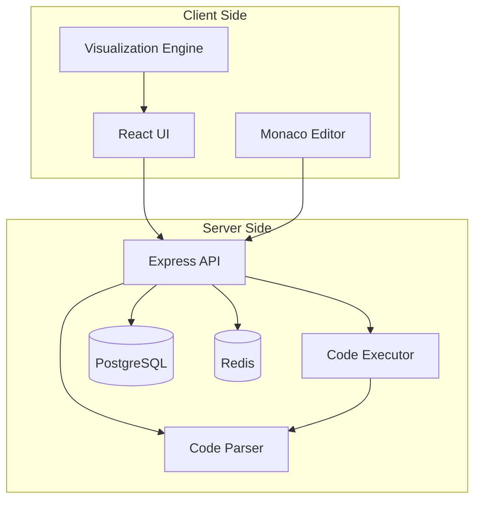
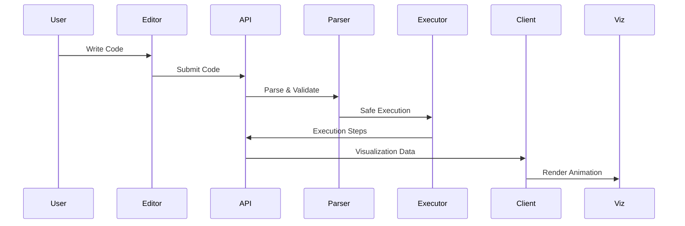
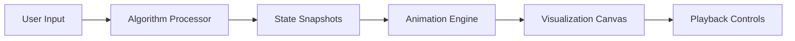

# Algorithm Visualizer - Architecture Document

## Project Overview
A comprehensive algorithm visualizer that allows users to:
- Visualize various data structures and algorithms
- Write custom code and visualize its execution
- Step through algorithms with animation controls
- Learn through interactive tutorials

## Technology Stack

### Frontend
- **Framework**: React 18+ with TypeScript
- **Styling**: Tailwind CSS + Shadcn/ui components
- **State Management**: Zustand or Redux Toolkit
- **Code Editor**: Monaco Editor (VS Code editor)
- **Visualization Libraries**: 
  - D3.js for complex visualizations
  - Framer Motion for animations
  - React Flow for graph visualizations
- **Build Tool**: Vite
- **Testing**: Vitest + React Testing Library

### Backend
- **Runtime**: Node.js 20+
- **Framework**: Express.js with TypeScript
- **Code Execution**: 
  - VM2 or isolated-vm for sandboxed JavaScript execution
  - Docker containers for other languages (Python, Java, C++)
- **Database**: PostgreSQL for data, Redis for caching
- **ORM**: Prisma
- **API**: RESTful + WebSocket for real-time updates
- **Testing**: Jest

### DevOps & Deployment
- **Containerization**: Docker
- **CI/CD**: GitHub Actions
- **Hosting**: 
  - Frontend: Vercel/Netlify
  - Backend: Railway/Render
  - Database: Supabase/Neon

## System Architecture



## Core Features Architecture

### 1. Algorithm Categories
- **Sorting**: Bubble, Quick, Merge, Heap, Radix, etc.
- **Searching**: Binary, Linear, Jump, Interpolation
- **Graph**: BFS, DFS, Dijkstra, A*, Kruskal, Prim
- **Trees**: BST, AVL, Red-Black, B-Tree, Heap
- **Dynamic Programming**: Knapsack, LCS, Edit Distance
- **String**: KMP, Rabin-Karp, Z-Algorithm
- **Mathematical**: Prime Sieve, GCD, Fast Exponentiation

### 2. Custom Code Execution Flow


### 3. Data Flow for Visualizations


## Security Considerations

### Code Execution Security
- Sandboxed environment using VM2/isolated-vm
- Resource limits (CPU, memory, execution time)
- Input validation and sanitization
- Rate limiting on API endpoints
- Code analysis for malicious patterns

### API Security
- JWT authentication for user sessions
- CORS configuration
- Input validation using Joi/Zod
- SQL injection prevention via Prisma
- XSS protection

## Database Schema

### Core Tables
- **algorithms**: Predefined algorithms with metadata
- **visualizations**: Saved visualization states
- **users**: User accounts (optional feature)
- **code_snippets**: User-submitted code examples
- **tutorials**: Step-by-step algorithm tutorials

## Frontend Component Structure

```
src/
├── components/
│   ├── Editor/
│   │   ├── CodeEditor.tsx
│   │   ├── InputPanel.tsx
│   │   └── OutputPanel.tsx
│   ├── Visualizer/
│   │   ├── Canvas.tsx
│   │   ├── Controls.tsx
│   │   └── algorithms/
│   │       ├── SortingVisualizer.tsx
│   │       ├── GraphVisualizer.tsx
│   │       └── TreeVisualizer.tsx
│   ├── Layout/
│   │   ├── Header.tsx
│   │   ├── Sidebar.tsx
│   │   └── Footer.tsx
│   └── UI/
│       └── [Shadcn components]
├── hooks/
├── services/
├── store/
└── utils/
```

## Backend API Structure

```
src/
├── controllers/
│   ├── algorithm.controller.ts
│   ├── execution.controller.ts
│   └── visualization.controller.ts
├── services/
│   ├── codeExecutor.service.ts
│   ├── parser.service.ts
│   └── sandbox.service.ts
├── middleware/
│   ├── auth.middleware.ts
│   ├── validation.middleware.ts
│   └── rateLimit.middleware.ts
├── routes/
├── models/
└── utils/
```

## Performance Optimizations

### Frontend
- Code splitting and lazy loading
- Memoization of expensive computations
- Virtual scrolling for large datasets
- Web Workers for heavy computations
- Debouncing/throttling for user inputs

### Backend
- Caching frequently accessed algorithms
- Database query optimization
- Connection pooling
- Horizontal scaling capability
- CDN for static assets

## Development Phases

### Phase 1: Foundation (Week 1-2)
- Project setup and configuration
- Basic UI layout and navigation
- Code editor integration
- Simple sorting algorithm visualizations

### Phase 2: Core Features (Week 3-4)
- Expand algorithm library
- Implement animation controls
- Add more visualization types
- Basic code execution

### Phase 3: Advanced Features (Week 5-6)
- Custom code visualization
- Step-by-step mode
- Tutorial system
- Performance optimizations

### Phase 4: Polish & Deploy (Week 7-8)
- UI/UX improvements
- Testing and bug fixes
- Documentation
- Deployment setup

## Scalability Considerations

- Microservices architecture for future expansion
- Message queue for async processing
- Horizontal scaling with load balancer
- CDN for global content delivery
- Database sharding for large datasets

## Monitoring & Analytics

- Error tracking with Sentry
- Performance monitoring with New Relic
- User analytics with Google Analytics
- Custom metrics dashboard